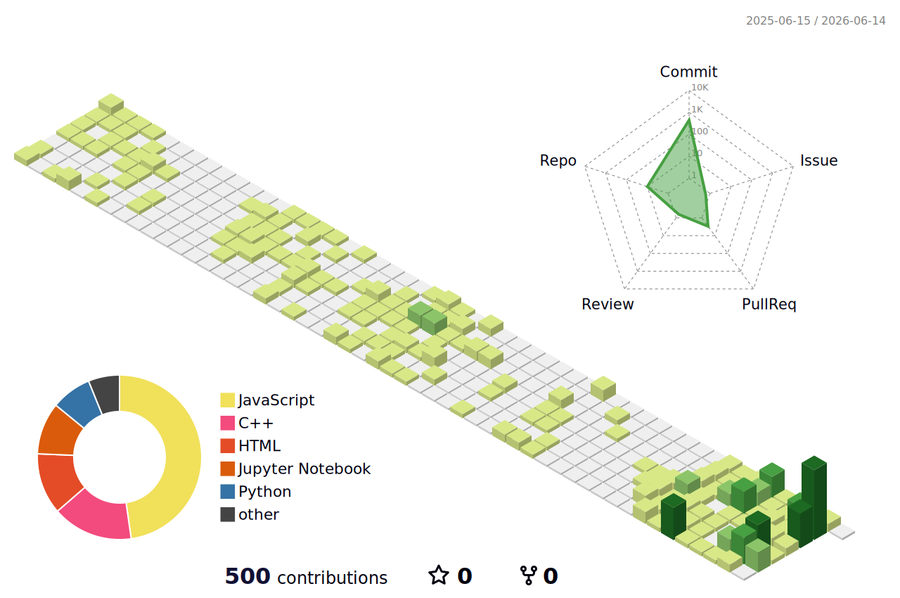

# Hassan Raza Shaikh

  

Hi! I'm Hassan, an Artificial Intelligence student and mathematics enthusiast. I focus on machine learning integrations, software development, and exploring core computational frameworks.

---

### Current Focus

- 🤖 **Agentic Workflows**: Deepening my understanding of autonomous AI agents and language models.
- 💻 **Full Stack**: Building responsive, typesafe web applications using React, Node.js, and TypeScript.
- 📐 **Mathematics & AI**: Studying advanced linear algebra, calculus, and neural network foundations.

---

### Featured Live Projects

<table>
  <tr>
    <td width="33%" valign="top">
      <b>🌐 <a href="https://hassan-portfolio-gold.vercel.app">Personal Portfolio</a></b> 
      My developer portfolio site showcasing active academic projects, development timeline, and technical competencies. 
       
      
    </td>
    <td width="33%" valign="top">
      <b>📚 <a href="https://frontend-xi-pink-10.vercel.app">GIKI Course Hub</a></b> 
      Our university academic resource platform, providing course material sharing and management. Currently live and actively used. 
       
      
    </td>
    <td width="33%" valign="top">
      <b>🎮 <a href="https://halvapuri.github.io/courses/">Wordlines</a></b> 
      An interactive logic game/graph implementation for pathfinding visualisations and word search grid navigation. 
       
      
    </td>
  </tr>
</table>

---

### Projects & Contributions

<!-- START_SECTION:projects -->
<table>
  <tr>
    <td width="50%" valign="top">
      <b>📚 <a href="https://github.com/Hassan-Raza-Shaikh/giki_course_hub-1">GIKI Course Hub</a></b> 
      Our university academic resource platform, providing course material sharing and management. Currently live and actively used. 
      <code>JavaScript</code>
    </td>
    <td width="50%" valign="top">
      <b>🤖 <a href="https://github.com/hamxa296/ML-Project-hehe">ML Project</a></b> <i>(Contributor)</i> 
      Collaborative machine learning pipeline implementing credit fraud detection and model ensemble comparisons. 
      <code>Python</code>
    </td>
  </tr>
  <tr>
    <td width="50%" valign="top">
      <b>🌱 <a href="https://github.com/ZainJ5/Plant-Growth-and-Harvesting-Monitoring-System">Plant Growth & Harvesting Monitoring System</a></b> <i>(Contributor)</i> 
      An IoT and computer vision monitoring system designed for tracking crop health metrics and harvesting cycles. 
      <code>Python</code>
    </td>
    <td width="50%" valign="top">
      <b>📁 <a href="https://github.com/Hassan-Raza-Shaikh/Projects">Projects</a></b> 
      Academic software developments, data structures implementations, and core computational logic systems. 
      <code>C++</code>
    </td>
  </tr>
  </tr>
  <tr>
    <td colspan="2" valign="top">
      <b>⚙️ <a href="https://github.com/Hassan-Raza-Shaikh/Python">Python Utilities</a></b> 
      A curated playground of Python implementations, scripting utilities, and numerical analysis models. 
      <code>Python</code>
    </td>
  </tr>
</table>
<!-- END_SECTION:projects -->

---

### Technologies & Tools

#### Languages
<!-- START_SECTION:languages -->
<table>
  <tr>
    <td align="center" width="96" valign="top">
       
      <b>Python</b>
    </td>
    <td align="center" width="96" valign="top">
       
      <b>C++</b>
    </td>
    <td align="center" width="96" valign="top">
       
      <b>JavaScript</b>
    </td>
    <td align="center" width="96" valign="top">
       
      <b>TypeScript</b>
    </td>
    <td align="center" width="96" valign="top">
       
      <b>HTML5</b>
    </td>
    <td align="center" width="96" valign="top">
       
      <b>CSS3</b>
    </td>
    <td align="center" width="96" valign="top">
       
      <b>SQL</b>
    </td>
    <td align="center" width="96" valign="top">
       
      <b>LaTeX</b>
    </td>
  </tr>
</table>
<!-- END_SECTION:languages -->

#### Frameworks & Libraries
<!-- START_SECTION:frameworks -->
<table>
  <tr>
    <td align="center" width="96" valign="top">
       
      <b>React</b>
    </td>
    <td align="center" width="96" valign="top">
       
      <b>Next.js</b>
    </td>
    <td align="center" width="96" valign="top">
       
      <b>Node.js</b>
    </td>
    <td align="center" width="96" valign="top">
       
      <b>Flask</b>
    </td>
    <td align="center" width="96" valign="top">
       
      <b>FastAPI</b>
    </td>
    <td align="center" width="96" valign="top">
       
      <b>Tailwind CSS</b>
    </td>
    <td align="center" width="96" valign="top">
       
      <b>Vite</b>
    </td>
  </tr>
</table>
<!-- END_SECTION:frameworks -->

#### AI & Data Science
<!-- START_SECTION:ai_data_science -->
<table>
  <tr>
    <td align="center" width="96" valign="top">
       
      <b>scikit-learn</b>
    </td>
    <td align="center" width="96" valign="top">
       
      <b>NumPy</b>
    </td>
    <td align="center" width="96" valign="top">
       
      <b>Pandas</b>
    </td>
    <td align="center" width="96" valign="top">
       
      <b>Matplotlib</b>
    </td>
    <td align="center" width="96" valign="top">
       
      <b>Seaborn</b>
    </td>
    <td align="center" width="96" valign="top">
       
      <b>Jupyter</b>
    </td>
    <td align="center" width="96" valign="top">
       
      <b>XGBoost</b>
    </td>
    <td align="center" width="96" valign="top">
       
      <b>LightGBM</b>
    </td>
  </tr>
  <tr>
    <td align="center" width="96" valign="top">
       
      <b>CatBoost</b>
    </td>
    <td align="center" width="96" valign="top">
       
      <b>Evidently</b>
    </td>
  </tr>
</table>
<!-- END_SECTION:ai_data_science -->

#### Databases & Cloud
<!-- START_SECTION:cloud_db -->
<table>
  <tr>
    <td align="center" width="96" valign="top">
       
      <b>Firebase</b>
    </td>
    <td align="center" width="96" valign="top">
       
      <b>AWS</b>
    </td>
    <td align="center" width="96" valign="top">
       
      <b>Vercel</b>
    </td>
  </tr>
</table>
<!-- END_SECTION:cloud_db -->

#### Tools & DevOps
<!-- START_SECTION:tools_devops -->
<table>
  <tr>
    <td align="center" width="96" valign="top">
       
      <b>Git</b>
    </td>
    <td align="center" width="96" valign="top">
       
      <b>Docker</b>
    </td>
    <td align="center" width="96" valign="top">
       
      <b>Pytest</b>
    </td>
    <td align="center" width="96" valign="top">
       
      <b>Prefect</b>
    </td>
  </tr>
</table>
<!-- END_SECTION:tools_devops -->

---

### Telemetry

  
  &nbsp;&nbsp;
  

  

---

  

---

  

---

  

---

### Connect

  
  &nbsp;
  
  &nbsp;
  

